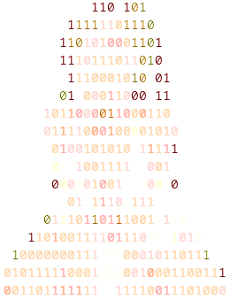
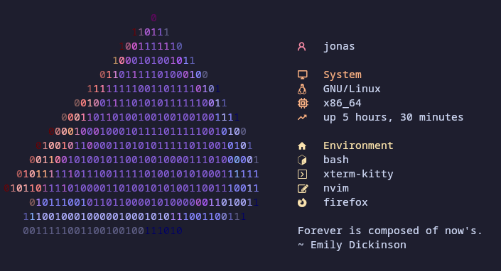

<h1 align="center">
    <code>$ waifufetch &gt;ω&lt;</code>
</h1>
<p align="center">
    
</p>
<p align="center">
    A <a href="https://github.com/dylanaraps/neofetch/">neofetch</a> alternative
</p>

## Requirements

- [Bun][]
- [Nerd Font][] (optional)


## Installation

```console
bun install --global github@phoenixr-codes/waifufetch
```

```console
waifufetch generate-config
```


## Usage

```console
waifufetch
```


## Preview

<p align="center">
  
</p>

## Philosophy

**waifufetch** is powered by _your_ type-safe, highly customizable configuration in [TypeScript][] with
[Bun][]'s powerful utilities such as its integrated [Shell API][].


## Configuration

You can use [TypeScript][], JavaScript or JSON for your configuration file. **waifufetch** searches for
any of these files in the given order and uses the first match:

1. `~/.config/waifufetch/config.ts`
2. `~/.config/waifufetch/config.js`
3. `~/.config/waifufetch/config.json`

> [!TIP]
> You can invoke an external script from [TypeScript][] or JavaScript that prints the configuration in JSON
> format and return it by parsing the JSON. This means you can use _any_ language you like.
>
> > `~/.config/waifufetch/config.js`
> > ```javascript
> > import { $ } from "bun";
> >
> > const config = await $`python config.py`.json();
> > export default config;
> > ```
>
> > `~/.config/waifufetch/config.py`
> > ```python
> > import json
> >
> > config = {
> >     # ...
> > }
> > print(json.dumps(config))
> > ```

> [!TIP]
> You can use a tool like [Ansize][] or [im2ansi][] to turn any image into an ANSI art that you can use as a logo
> in **waifufetch**.

The [default configuration][configuration template] obtainable with `$ waifufetch generate-config` can be used as a reference.


## Similar Projects

- [fastfetch](https://github.com/fastfetch-cli/fastfetch)
- [neofetch](https://github.com/dylanaraps/neofetch/)
- [pfetch](https://github.com/dylanaraps/pfetch)
- [ufetch](https://gitlab.com/jschx/ufetch)

[im2ansi]: https://github.com/phoenixr-codes/im2ansi
[configuration template]: https://github.com/phoenixr-codes/waifufetch-config
[Ansize]: https://github.com/jhchen/ansize
[Bun]: https://bun.sh/
[Nerd Font]: https://www.nerdfonts.com/#home
[Shell API]: https://bun.sh/docs/runtime/shell
[TypeScript]: https://www.typescriptlang.org/
